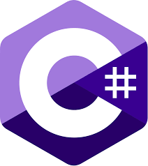

## 
  Андрей Авраменко 

#### 
 Бэкенд разработчик 

  

## Стек
<table>
    <tr>
        <td valign="top">
</td><td valign="top" width="33%">

### Бэкенд 

  
      
    
      
    
    
    
     

</td><td valign="top" width="33%">

### Администрирование  

  

 

</td>
</tr>
</table>

  
    
    

 
